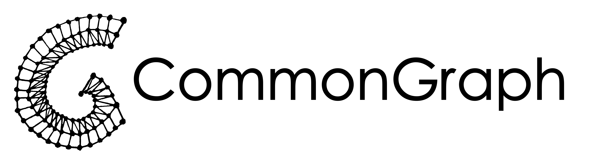

# 

**Free and open source platform builder for graph-based knowledge co-production and collaboration.**

---

## Quick Links

- 📚 **[Full Documentation](https://docs.commongraph.org)** — Complete guides and references
- 🚀 **[Quick Start](https://docs.commongraph.org/getting-started/quick-start/)** — Running locally in 10 minutes
- 🐳 **[Deployment Guide](https://docs.commongraph.org/deployment/)** — Production setup with Docker
- 🔗 **[API Reference](https://docs.commongraph.org/api/)** — REST API documentation

## What is CommonGraph?

CommonGraph is an open-source platform builder for co-creating collaborative knowledge graphs.
Structure information as interconnected nodes and edges, define custom data models, manage permissions, and gather community feedback—all without coding.

Perfect for:
- Building knowledge bases with interconnected information
- Visualising complex relationships relevant to your communities
- Creating transparent, participative decision-making systems

## Key Features

- **Graph-based data model** — Nodes and edges with custom properties
- **Flexible schemas** — Define your own data structures in YAML
- **Role-based permissions** — Control access at the platform level
- **Community feedback** — Polls and ratings on any content
- **REST API** — Full programmatic access
- **Docker deployment** — Easy local and production setup
- **Open source** — Licensed under GNU AGPL

## Development

See [Contributing Guide](https://docs.commongraph.org/contributing/) for development setup and code standards.

## Support

- 📖 [Documentation](https://docs.commongraph.org)
- 🐛 [Report Issues](https://github.com/comodelling/commongraph/issues)
- 💬 [GitHub Discussions](https://github.com/comodelling/commongraph/discussions)
- 📧 [Contact](mailto:contact@comodelling.org)

## License

Code: GNU Affero General Public License v3.0 — see [COPYING](COPYING) for details.
Docs: CC BY-SA 4.0, see [docs/LICENSE](docs/LICENSE) for details

## Credits

Copyright 2025 [CommonGraph contributors](./CONTRIBUTORS.md)
